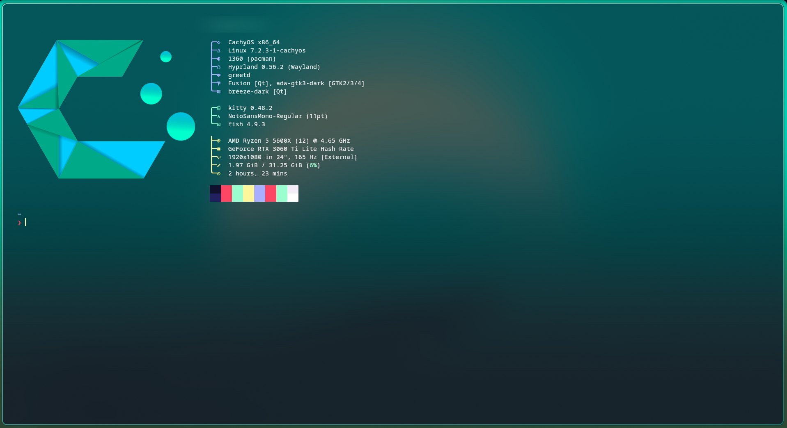
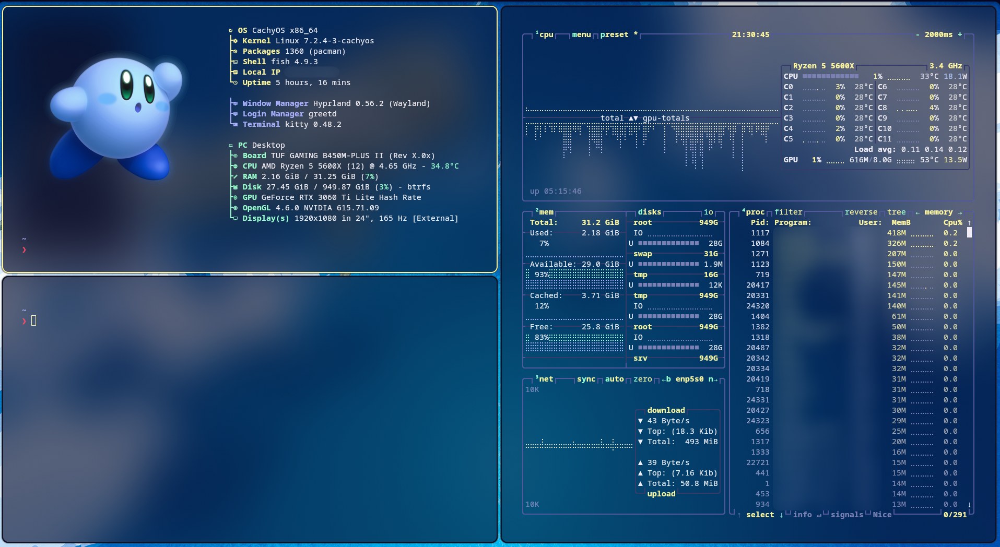
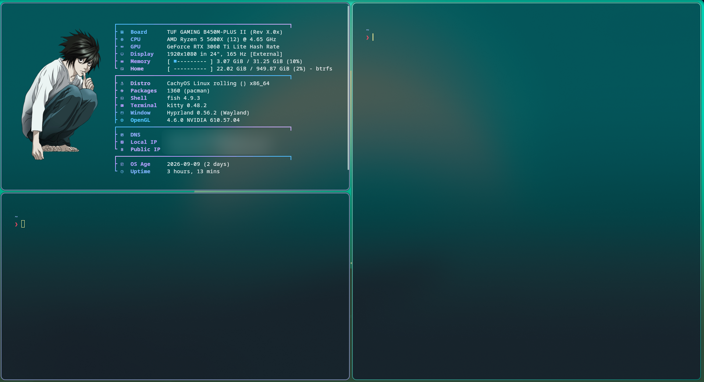
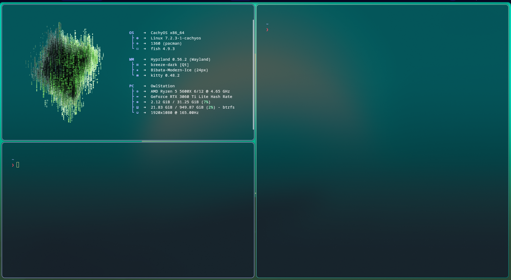
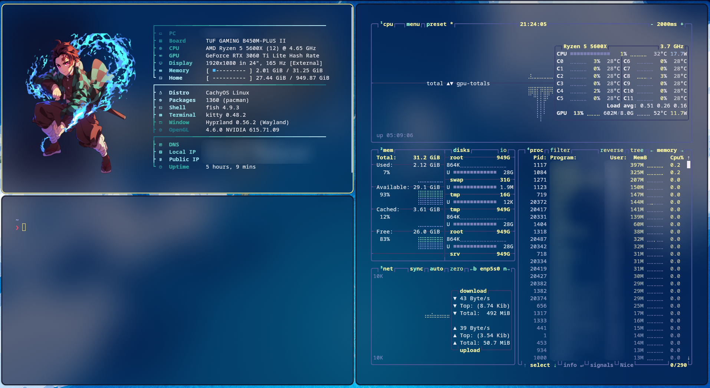

GitOwl58 Fastfetch Config CachyOS Hyprland

# Screenshots

<table>
  <tr>
    <td align="center">
      <br/>
      <sub><b>CachyOS</b></sub>
    </td>
    <td align="center">
      <br/>
      <sub><b>Kirby</b></sub>
    </td>
  </tr>
  <tr>
    <td align="center">
      <br/>
      <sub><b>Death Note</b></sub>
    </td>
    <td align="center">
      <br/>
      <sub><b>Abstract Binary</b></sub>
    </td>
  </tr>
  <tr>
    <td align="center">
      <br/>
      <sub><b>Tanjiro</b></sub>
    </td>
  </tr>
</table>

# Requirements

- [fastfetch](https://github.com/fastfetch-cli/fastfetch) installed

run:  sudo pacman -S fastfetch

# Installation

Clone the repo:

run:    git clone https://github.com/GitOwl58/Fastfetch.git


Or download it as a ZIP and extract it.

Then move the contents into your existing fastfetch config folder:

run:    mv Fastfetch ~/.config/fastfetch/

run:	fastfetch

# Switching Presets

In presets find the one you like, then after rename config.jsonc rename that
preset config.jsonc and move it to ~/.config/fastfetch.

# Switching between PNG and ASCII logos

By default this config uses a PNG logo. If you'd rather use classic ASCII art, 
open `config.jsonc` and change the `logo` section:

```jsonc
"logo": {
    "type": "auto"
}
```

Or point it explicitly at fastfetch's built-in ASCII logos:

```jsonc
"logo": {
    "type": "builtin",
    "source": "cachyos_small"
}
```

To use a custom PNG of your own, replace the logo file in the repo and update the
 `source` path in `config.jsonc` accordingly.

# Customization

See the [official fastfetch 
wiki](https://github.com/fastfetch-cli/fastfetch/wiki/Configuration) for the full 
list of available modules and options.

# License

Feel free to fork, modify, and use however you like.
                    
                    GitOwl58.
